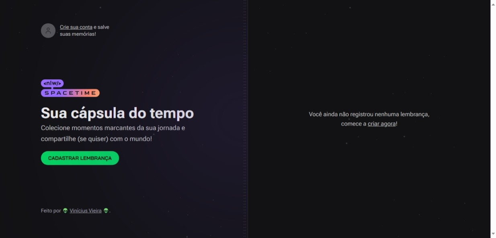
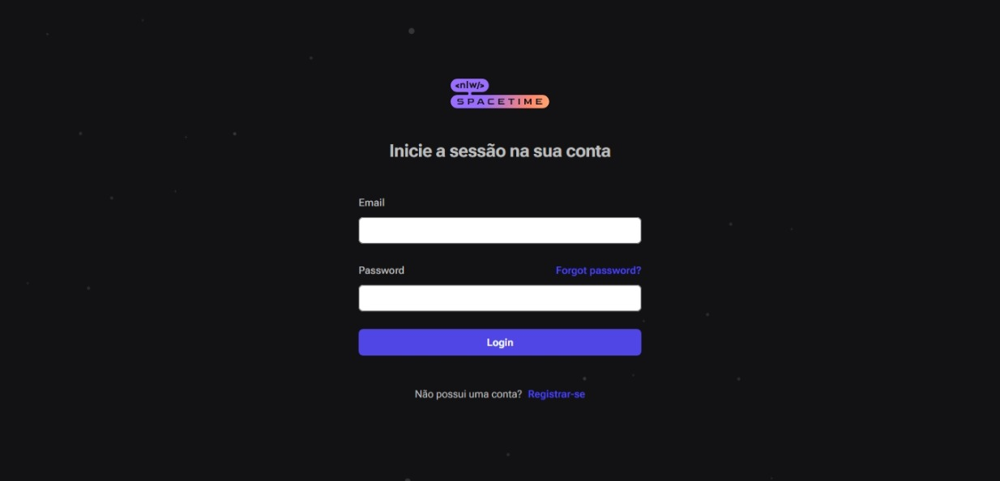
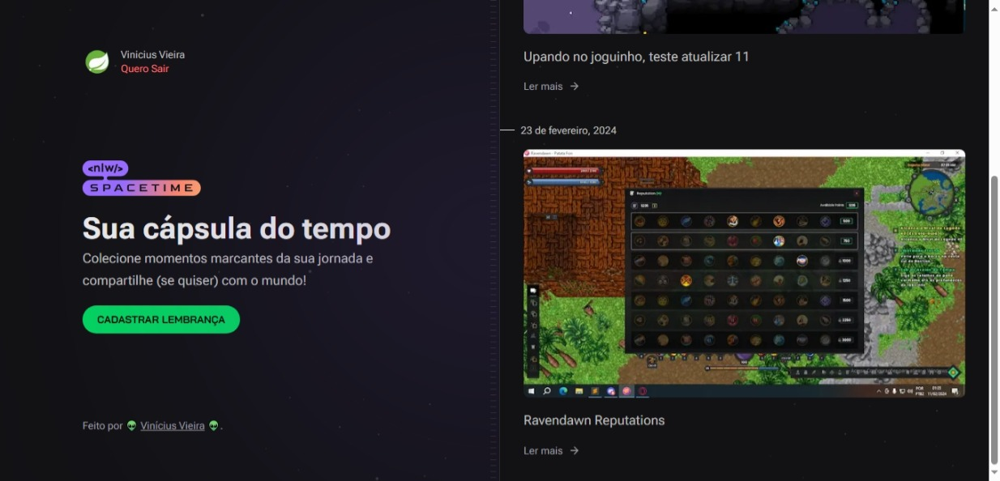
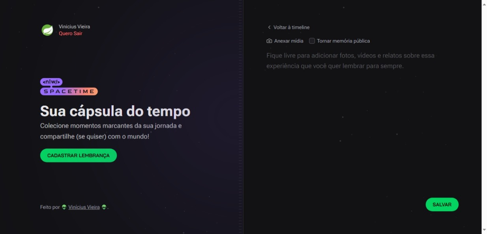
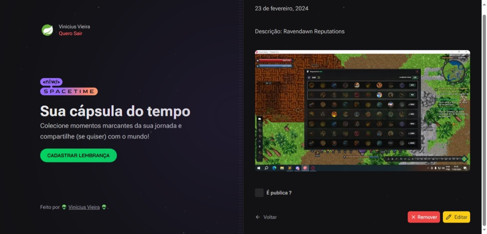
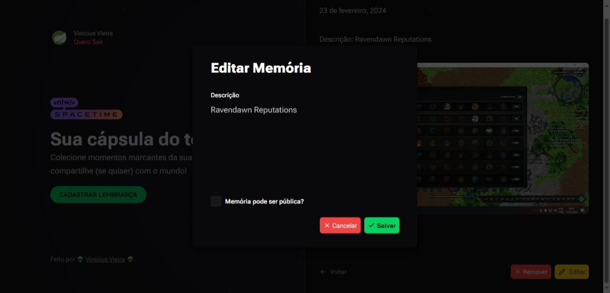
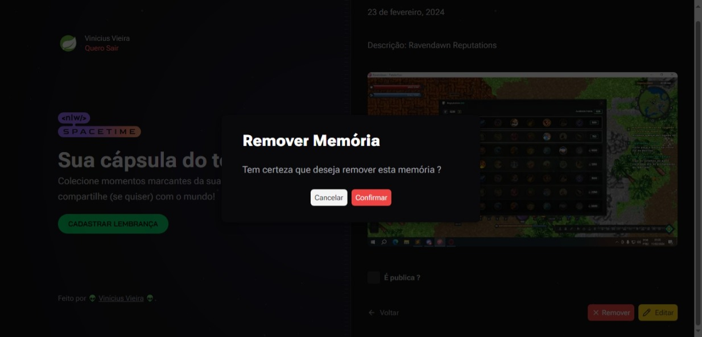
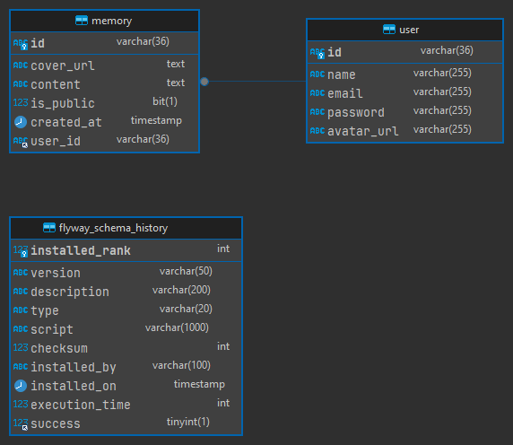

<h1 align="center"> NLW Spacetime </h1>

Evento exclusivo e gratuito, promovido pela Rocketseat para ensino de tecnologias Frontend e Backend.

  <a href="#🚀-tecnologias">Tecnologias</a>&nbsp;&nbsp;&nbsp;|&nbsp;&nbsp;&nbsp;
  <a href="#💻-projeto">Projeto</a>&nbsp;&nbsp;&nbsp;|&nbsp;&nbsp;&nbsp;
  <a href="#🖼-screenshot-web">Screenshot</a>&nbsp;&nbsp;&nbsp;|&nbsp;&nbsp;&nbsp;
  <a href="#📝-licença">Licença</a>

  

 

  

## 🚀 Tecnologias

Esse projeto foi desenvolvido com as seguintes tecnologias:

- NextJS
  - Tailwindcss
  - Typescript
  - Lucide-react
  - Radix UI
  - Sonner
- Java
  - Java 17
  - Spring Boot Framework
  - Spring Boot Security
  - JWT Token
  - Spring Validation
  - Model Mapper
  - MySQL
  - Flyway

## 💻 Projeto

O Nlw Spacetime foi um evento visando ensinar programação na prática.

A aplicação procura funcionar como uma capsula do tempo, onde o usuário após se cadastrar, pode realizar registros de suas atividades e decidir se quer tornar esta publicação pública ou privada.

## 🖼 ScreenShot Web

  
  
  
  
  
  

## Diagrama Entidade-Relacionamento

  

## 📝 Licença

Esse projeto está sob a licença MIT.

---

Feito com ♥ by Rocketseat :wave: [Participe da nossa comunidade!](https://discord.gg/rocketseat)